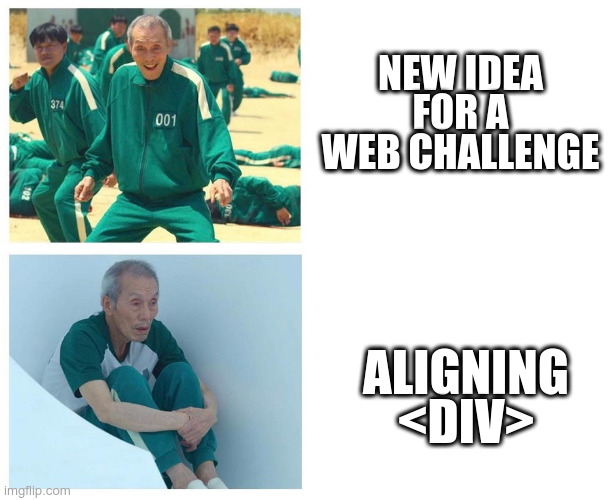

# FCSC 2022 Header

Pour cette épreuve, vous devrez vous pencher sur une fonctionnalité essentielle du protocole HTTP.

Auteur : [Cryptanalyse](https://twitter.com/Cryptanalyse)

Origine : [Header](https://hackropole.fr/fr/challenges/web/fcsc2022-web-header/)

-----------

## Connectez vous 
> http://localhost

-----------

## Installation manuel
Vous n'utilisez pas l'application **les CTFs de Cyrhades** ? C'est dommage !
Mais voici comment installer ce CTF manuellement :

> git clone https://github.com/Hack-Oeil/fcsc2022-web-header.git

> cd fcsc2022-web-header

-----------

## Sur le site officiel hackropole.fr
> https://hackropole.fr/fr/challenges/web/fcsc2022-web-header/